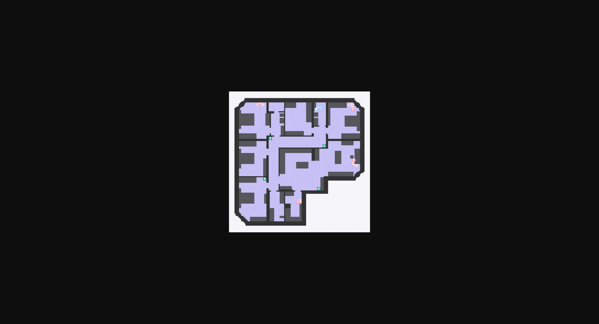

# 项目简介

> 视频: https://kaiwu-assets-1258344700.file.myqcloud.com/c/bd/20260330/83feaccd80dd7158778bf09d1c4e7d7a-robot_vacuum_commentary.mp4

## 任务目标
**路径规划 - 区域覆盖**

小悟机器人在规定时间内和能量耗尽前，清扫尽可能多的地面。机器人初始 200 电量（可配置），每走一步消耗一格电量，经过污渍地面自动完成清扫。

地图中存在充电桩，机器人抵达充电桩范围内，立即充满能量（200电量）。

地图中存在官方机器人，官方机器人会持续清扫其出生点附近 10 格地面，小悟机器人需避免撞到官方机器人，撞到即任务立即终止。


## 环境介绍

### 地图
地图大小为**128×128（栅格化地图）**，左上角为地图原点 (0,0)，x 轴向右为正，z 轴向下为正。为考察模型泛化能力，本赛题共提供十五张地图：十张开放给选手训练、评估，五张作为隐藏地图用于最终测评。


### 元素介绍
地图中包含**小悟机器人、官方机器人、小悟机器人出生点、官方机器人出生点、污渍地面、充电桩、道路、障碍物**。


| 元素 | 说明 |
| --- | --- |
| 小悟机器人 | 智能体可以控制小悟机器人在地图中进行移动。每走一步消耗一格电量，经过污渍地面自动完成清扫。机器人抵达充电桩范围内，立即充满电量（默认200电量，可配置）。小悟机器人需避免撞到官方机器人（距离小于等于1格即为碰到，即走到以官方机器人为中心3x3的范围内），任务终止。 |
| 官方机器人 | 任务开始时，生成4个（可配置）官方机器人。官方机器人会在出生点上、下、左、右四个方向拓宽10格的正方形区域（21×21格）范围内随机移动。如移动到污渍上则完成该污渍的清扫。 |
| 小悟机器人出生点 | 任务开始时，小悟机器人起始位置，可随机出现在非充电桩以及障碍物的任意道路上。且会距离所有官方机器人出生点5格以上。 |
| 官方机器人出生点 | 官方机器人出生位置，位于道路。出生点均匀分布，每个官方机器人的活动范围（21×21）且不重叠。 |
| 污渍地面 | 所有道路在任务开始时都为污渍地面，在小悟机器人或官方机器人路过后完成污渍的清扫。 |
| 充电桩 | 4个（可配置），每个充电桩占3×3格。机器人抵达充电桩范围内，立即充满能量（200电量，可配置）。 |
| 道路 | 智能体可以正常移动的区域。在道路中智能体有8个移动方向，智能体在执行一个动作时，会朝该动作的方向持续移动1步。所有路径相互连通，不存在孤立区域。 |
| 障碍物 | 障碍物会阻碍智能体的移动，当智能体向有障碍物的方向移动时，将会停留在原地。障碍物形式由家具、墙和户外空间组成。 |
在创建训练任务和评估任务时，上述元素的配置方式有所不同。具体请查看[开发指南-环境配置](/docs/p-competition-robot_vacuum/13.0.1/guidebook/dev-guide/env/#%E7%8E%AF%E5%A2%83%E9%85%8D%E7%BD%AE)部分。


### 小悟机器人

| 属性 | 说明 |
| --- | --- |
| 数量 | 1 |
| 默认动作空间 | 8（八个方向移动） |
| 视野域 | 以智能体为中心，分别向上、下、左、右四个方向拓宽10格的正方形区域，即21×21 |
| 移动速度 | 1格/步 |
| 初始电量 | 200（可配置） |
| 电量消耗 | 1/步 |

### 计分规则

```
任务得分 = 清扫得分 = 清扫地面数量
```
清扫得分为被小悟机器人（智能体）清扫的污渍地面数量。每清扫1格污渍地面，得分+1。官方机器人清扫的格子不计入玩家得分，且官方机器人清扫过的地面，小悟机器人再清扫无效。


### 终止条件

| 终止原因 | 任务状态 | 说明 |
| --- | --- | --- |
| 达到最大步数 | completed | 正常完成任务 |
| 电量耗尽 | failed | `battery ≤ 0` |
| 碰撞官方机器人 | failed | 小悟机器人进入官方机器人 3×3 范围 |


---