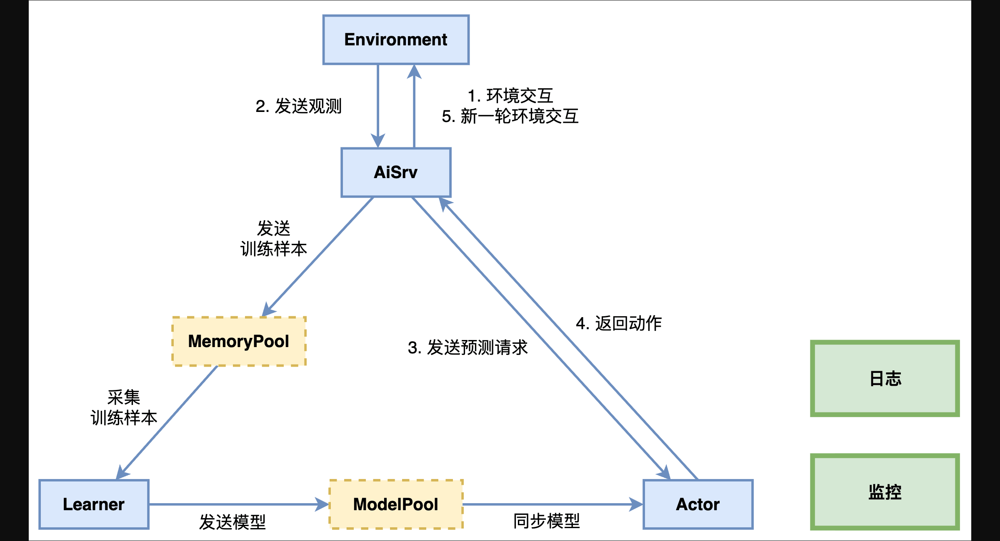

# 分布式计算框架
在强化学习项目的开发中，​分布式计算框架是支撑大规模训练任务的核心基础设施。本开发框架提供了由腾讯王者荣耀团队自主研发的强化学习分布式计算框架KaiwuDRL，通过并行化计算、高效资源调度和分布式协同优化，显著提升智能体训练的效率与稳定性。

接下来，我们将详细介绍KaiwuDRL的系统架构与核心能力，帮助开发者进一步理解训练和评估工作流的运行逻辑。


## 总体架构

### 组件介绍
如上图所示，KaiwuDRL 的整体架构包括 Environment、Aisrv、Actor、Learner 等强化学习组件（均支持多实例并行运行）。此外，还集成了通信、日志、监控、对象存储等基础组件。

组件介绍如下表：


| 组件名称 | 功能描述 |
| --- | --- |
| Environment | 环境服务组件，负责运行强化学习环境，支持通过标准接口与环境交互，并返回环境的观测obs。 |
| Aisrv | 训练流程中枢，负责收集环境样本，运行训练、评估工作流，以及处理各个组件间的数据传输。 |
| Actor | 预测服务组件，负责响应Aisrv的预测请求，调用智能体 predict() 或 exploit() 函数生成动作决策结果。 |
| Learner | 训练服务组件，负责采集训练样本，调用智能体 learn() 函数完成梯度计算及模型迭代。 |
| MemoryPool | 样本存储组件，简称样本池。负责存储训练样本，接收 Aisrv 打包的训练样本，发往 Learner 用于智能体训练。 |
| ModelPool | 模型存储组件，简称模型池。负责存储模型参数文件，接收 Learner 产出的模型参数文件，将最新的模型参数文件发送给Actor。 |
| 日志 | 日志采集组件，负责记录强化学习系统中各个组件的运行日志，支持通过标准接口上报日志。 |
| 监控 | 监控采集组件，负责采集系统资源使用率、训练指标趋势等数据，支持通过标准接口上报数据指标。 |
**MemoryPool和ModelPool仅在分布式训练时启用。**


### 服务介绍
基于上述组件，KaiwuDRL 提供了预测服务和训练服务：


#### 预测服务
- Aisrv → Environment：发送环境配置并创建新一局episode；
- Environment → Aisrv：返回原始观测数据；
- Aisrv → Actor：Aisrv基于原始观测数据，向Actor发送预测请求；
- Actor：使用预测请求中的观测进行特征处理，智能体基于特征处理后的数据进行预测，并且将预测数据处理为环境可以识别的动作指令，发送给Aisrv；
- Aisrv：使用动作指令与环境Environment进行交互，Environment返回新的观测；

#### 训练服务
- Aisrv：预测服务不断产生轨迹数据，Aisrv完成样本处理，并发送至样本池；
- Learner：从样本池按批采集样本进行训练，并将最新的模型参数同步至Actor；


---

## 工作流
KaiwuDRL提供了训练、评估工作流的接口函数，开发者可以按需灵活调用上述组件和服务，以实现模型的训练和评估。


### 训练工作流
开发目录：`/workflow/train_workflow.py`


#### workflow
训练工作流的核心函数，在workflow中可自定义训练流程。可以在[智能体/工作流开发](/docs/p-competition-robot_vacuum/13.0.1/guidebook/taa-rl-fw/rl_agent/workflow/)中查看详细的训练工作流代码示例。


```
@attached
def workflow(envs, agents, logger=None, monitor=None):
```
**Parameters**


| 参数名 | 介绍 |
| --- | --- |
| envs | list类型，环境列表，返回当前正在运行的环境。 |
| agents | list类型，智能体列表，通过调用开发者实现的 `/agent.py` 实例化 Agent, 并作为输入传入 `workflow`。 |
| logger | Logger类型，框架提供的日志组件，接口与 python 的 `logging` 库一致。 |
| monitor | Monitor类型，框架提供的监控组件。 |

---


### 评估工作流
在运行训练任务（训练工作流）并获得模型文件后，可以通过运行评估任务（评估工作流），对模型能力进行验证。

当开发者在使用腾讯开悟平台所提供的强化学习项目时，评估工作流由腾讯开悟官方实现，开发者无法修改。评估工作流会调用开发者自定义的`agent.exploit()`函数。


---

## Agent
KaiwuDRL提供了智能体相关的接口函数，开发者可以按需实现以下接口函数，并在训练工作流中调用。

开发目录：`/agent.py`


### learn
该函数输入为训练样本数据，开发者需要在该函数中调用算法消费训练样本进行训练。  

当然，在不同的训练模式下，该函数使用方法有所不同：

- 单机训练：开发者需要在训练工作流中手动调用该函数以进行一步训练。
- 分布式训练：该函数作为训练函数会被循环执行，无需开发者手动调用。
- 但该函数还作为样本发送函数，开发者需要在训练工作流中手动调用，以将样本发送至样本池。

```
@learn_wrapper
def learn(self, list_sample_data):
```
**Parameters**


| 参数名 | 介绍 |
| --- | --- |
| list_sample_data | list类型，训练样本(SampleData)列表，Learner从样本池按照配置项`train_batch_size`采样一批样本, 作为输入传入 `learn()` 函数。 |
**配置项**

开发目录: `/conf/configure_app.toml`

Learner在每一次执行`learn()`函数时，会从样本池采样一批样本作为输入。并按照开发者配置的频次`dump_model_freq`保存模型参数文件，模型同步服务将按照配置`model_file_sync_per_minutes`将模型参数文件推送至模型池。

Actor中的模型同步服务将按照配置`model_file_sync_per_minutes`，从模型池获取最新模型参数文件。

相关配置项如下：


```
[app]
# The time interval for executing the learn() function, configurable to throttle the Learner and balance sample production/consumption.
# 执行learn函数进行训练的时间间隔，可通过该配置让Learner休息以调节样本生产消耗比
learner_train_sleep_seconds = 0.001

# Replay buffer configurations
# 样本池容量
replay_buffer_capacity = 4096

# The ratio of the sample pool capacity that triggers training
# 当样本池中的样本占总容量的比例达到该值时，启动训练
preload_ratio = 1.0

# When new samples are added to the sample pool, the logic for removing old samples: reverb.selectors.Lifo, reverb.selectors.Fifo
# 当新样本加入样本池时，旧样本的移除逻辑，可选项：reverb.selectors.Lifo, reverb.selectors.Fifo
# reverb.selectors.Lifo：先进后出(Last In, First Out)
# reverb.selectors.Fifo：先进先出(First In, First Out)
reverb_remover = "reverb.selectors.Fifo"

# The sampling logic of the Learner from the sample pool: reverb.selectors.Fifo, reverb.selectors.Uniform
# Learner从样本池中采样的逻辑，可选项：reverb.selectors.Fifo, reverb.selectors.Uniform
# reverb.selectors.Uniform：Samples are selected uniformly at random from the replay buffer, with each sample having an equal probability of being chosen.
# reverb.selectors.Uniform：从回放缓冲区中随机均匀地选择样本，每个样本被选中的概率相同。
# reverb.selectors.Fifo：Samples are selected in the order they were added to the replay buffer.
# reverb.selectors.Fifo：按照先进先出从回放缓冲区中选择样本。
reverb_sampler = "reverb.selectors.Uniform"

# Training batch size limit for Learner
# Learner训练时样本批处理大小
train_batch_size = 2048

# Model dump frequency (steps)
# 训练间隔多少步输出模型参数文件
dump_model_freq = 1000

# The Learner pushes model updates, and the frequency at which Actors fetch the model (in minutes).
# Learner推送模型参数文件至模型池，以及Actor从模型池获取模型参数文件的频次（单位：分钟）
model_file_sync_per_minutes = 1

# he number of model updates pushed per learner iteration, and the maximum number of updates each actor can fetch at once (cap: 50).
# Learner每次推送模型参数文件，以及Actor每次获取模型参数文件的数量（上限：50）
modelpool_max_save_model_count = 1
```


---

### predict
该方法通过调用模型进行预测，通常在训练时调用该方法，依策略的概率分布采样或引入随机概率。


```
@predict_wrapper
def predict(self, list_obs_data, list_state):
    return [ActData]
```
**Parameters**


| 参数名 | 介绍 |
| --- | --- |
| list_obs_data | list类型，观测数据(ObsData)列表 |
| list_state | 可选参数，list类型，环境返回的状态数据列表 |
**Return**


| 参数名 | 介绍 |
| --- | --- |
| List(ActData) | list类型，开发者定义的动作数据(ActData)列表 |


---

### exploit
该方法通过调用模型进行预测，通常在评估时调用该方法，选取策略中概率最高的动作或者策略认为最优的动作。


```
@exploit_wrapper
def exploit(self, observation):
```
**Parameters**


| 参数名 | 介绍 |
| --- | --- |
| observation | dict类型，环境观测字典，评估工作流中将原始的环境观测信息作为输入传入 `agent.exploit()`。 |
**Return**


| 参数名 | 介绍 |
| --- | --- |
| action | list类型，动作列表，环境可以直接使用的动作指令 |


---

### load_model
智能体通过该接口完成模型参数加载。在上文中提到，Actor会从模型池中获取最新模型参数文件，开发者需要手动调用`load_model()`函数，使智能体完成模型参数加载。


```
@load_model_wrapper
def load_model(self, path=None, id="1"):
    # When loading the model, you can load multiple files,
    # and it is important to ensure that each filename matches the one used during the save_model process.
    # 加载模型, 可以加载多个文件, 注意每个文件名需要和save_model时保持一致
    model_file_path = f"{path}/model.ckpt-{str(id)}.pkl"
    self.model.load_state_dict(
        torch.load(model_file_path, map_location=self.device),
    )
```
**Parameters**


| 参数名 | 介绍 |
| --- | --- |
| path | string类型，加载模型参数文件的路径，开发框架根据使用场景得到相应的路径, 并作为输入传入 `load_model` |
| id | string类型，模型参数文件的 id，使用 id 指定加载的模型参数文件 |


---

### save_model
开发者可以通过该函数保存当前时刻的模型文件及智能体代码包，开发框架会将开发者需要保存的内容打包为zip格式的文件。

当开发者使用腾讯开悟客户端开发时，开发框架会在客户端指定目录下存储该zip文件。

当开发者使用腾讯开悟平台时，开发框架会将该zip文件存储在云端，开发者可以通过平台的训练管理模块查看每一个训练任务的zip文件，即模型。


```
@save_model_wrapper
def save_model(self, path=None, id="1"):
    # To save the model, it can consist of multiple files,
    # and it is important to ensure that each filename includes the "model.ckpt-id" field.
    # 保存模型, 可以是多个文件, 需要确保每个文件名里包括了model.ckpt-id字段
    model_file_path = f"{path}/model.ckpt-{str(id)}.pkl"
    # Copy the model's state dictionary to the CPU
    # 将模型的状态字典拷贝到CPU
    model_state_dict_cpu = {k: v.clone().cpu() for k, v in self.model.state_dict().items()}
    torch.save(model_state_dict_cpu, model_file_path)
```
**Parameters**


| 参数名 | 介绍 |
| --- | --- |
| path | string类型，模型文件保存的路径，开发框架根据使用场景得到相应的路径, 并作为输入传入 `save_model` |
| id | string类型，模型文件的索引，开发框架获取到模型池中最新模型的索引, 并作为输入传入 `save_model` |


---

## 其他功能

### 加载预训练模型
本框架支持在已有的模型（称为预训练模型）基础上继续训练。预训练模型结构和继续训练的模型结构需保持一致。

- 当使用腾讯开悟平台时，在创建训练任务时，可以在弹窗中选择预训练模型以继续训练。


- 当使用腾讯开悟客户端时，需要将训练好的模型文件（`客户端工作空间/ckpt`路径下的pkl类型文件）放入代码包中，并在代码包`conf/configure_app.toml`中完成预训练模型相关的配置，配置说明如下：


```
# Whether to enable the preload model function. If enabled (true), the model specified by preload_model_id will be loaded as the initial model in the preload_model_dir directory; if disabled (false), no preloading will be performed.
# 是否启用加载预训练模型功能，若开启(true)，将在preload_model_dir目录下加载由preload_model_id指定的模型作为初始模型；若关闭(false)，则不加载预训练模型。
preload_model = false

# The relative path of the preloaded model folder (the variable name {agent_name} refers to the agent_algorithm name directory in the code package). It is only effective when preload_model=true. When the preload model function is enabled, you need to create a new ckpt folder under the agent_algorithm name directory in the code package and place the model file (.pkl) there.
# 预训练模型文件夹相对路径(变量名{agent_name}指代码包中agent_算法名目录)，仅在preload_model=true时生效；当开启加载预训练模型功能时，需要在代码包中agent_算法名目录下新建ckpt文件夹，将模型文件（.pkl）放置此即可。
preload_model_dir = "{agent_name}/ckpt"

# The identification ID of the preloaded model (here refers to the number of model training steps). This ID corresponds to the number of training steps recorded in the model file name. It only takes effect when preload_model=true.
# Note that it is forbidden to modify the original model file name, otherwise the model preloading process will fail.
# 预训练模型的标识ID（这里指模型训练步数），该ID对应模型文件名中的训练步数记录。仅在preload_model=true时生效。
# 注意，禁止修改原始模型文件名，否则将导致预训练模型加载失败。
preload_model_id = 1000
```
**客户端继续训练使用示例**

以加载 40052步的DQN模型 为例：

- 解压模型压缩包，在ckpt路径下找到名为 `model.ckpt-40052.pkl` 的模型文件
- 将模型文件放到代码包路径下，例如在`agent_dqn`内新建一个`ckpt`目录，放入上述模型文件
- 在代码包`conf/configure_app.toml`中完成以下配置：

```
preload_model = true
preload_model_dir = "agent_dqn/ckpt"
preload_model_id = 40052
```
完成上述步骤后，Aisrv和Learner将加载预训练模型以继续训练。


### 加载对手模型功能
在使用腾讯开悟平台时，部分项目支持从平台的模型管理中加载自定义模型。
用户可以在 `kaiwu.json` 文件中配置期望用作对手模型的模型 ID。智能体通过 `load_opponent_agent()` 函数完成对手模型的加载。

该功能允许智能体加载指定的网络结构和参数，并根据模型文件中的实现调用 agent 的`reset`、`predict`、`exploit`等方法。
对手模型作为固定水平的自定义模型，可以在 PVP 任务中用于训练评估，以反映训练过程中模型水平的提高。

以下是`load_opponent_agent()`函数示例：


```
@load_opponent_agent_wrapper
def load_opponent_agent(self, id="1"):
    # Framework provides loading opponent agent function, no need to implement function content
    # 框架提供的加载对手模型功能，无需实现函数内容
    pass
```
**Parameters**


| 参数名 | 介绍 |
| --- | --- |
| id | string类型，平台模型管理的 模型id，使用 id 指定加载的模型文件 |
以下是kaiwu.json的配置示例：


```
{
    "model_pool": [609, 608]
}
```

### 策略类型选择
本框架支持两种核心的训练范式：**同策略（On-Policy）**与**异策略（Off-Policy）**。此选择是训练流程的基础，将直接影响数据的使用方式、内存占用以及部分超参数的推荐设置。


| 特性 | On-Policy | Off-Policy |
| --- | --- | --- |
| 数据来源 | 必须使用由当前正在训练的策略实时与环境交互产生的新数据。 | 可以使用历史经验数据，这些数据可能来自旧版本的策略或不同的探索策略。 |
| 数据使用 | 一次性为主。数据在用于一次策略更新后通常被丢弃，以确保训练数据与当前策略的一致性。 | 可重复利用。数据被存储在“经验回放缓冲区”中，可被多次采样用于训练。 |
| 主要优势 | 训练稳定，理论收敛性有保障，行为容易理解。 | 数据效率高，可充分利用每一次交互获得的数据，更适合现实世界中交互成本高的场景。 |

#### 配置参数详解
在代码包`conf/configure_app.toml`中，通过以下参数进行设置：


```
# Training paradigm: on-policy or off-policy
# 训练时采用on-policy, off-policy
algorithm_on_policy_or_off_policy = "on-policy"

# Model dump frequency (steps)
# Interval (in steps) for saving model parameter files.
# on_policy: set to 1 for optimal training.
# off_policy: recommend 1000 to reduce save frequency.
# 训练间隔多少步输出模型参数文件, on_policy时设置为1训练效果最好，off_policy时建议设置为1000, 减少模型保存频率
dump_model_freq = 1
```