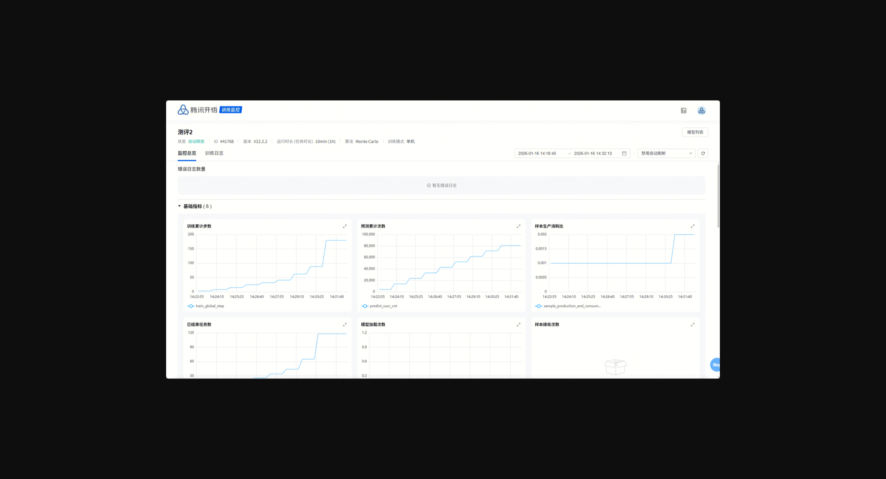

# 监控与日志
本文介绍如何使用腾讯开悟平台的监控与日志功能，帮助您实时掌握训练状态、快速定位问题。


## 监控

### 查看监控面板
在**训练管理**页面，点击**查看监控**按钮，即可打开监控面板：


### 监控面板组成
监控面板包含两个核心模块：


| 模块 | 功能 |
| --- | --- |
| 错误日志数量 | 展示各模块的错误日志统计，点击可查看详情 |
| 监控指标图 | 展示训练过程中的各类数据指标 |

### 指标分类
监控指标分为四类：


| 分类 | 说明 |
| --- | --- |
| 基础指标（basic） | 训练进度相关的核心数据，如训练步数、预测次数等 |
| 硬件指标（hardware） | 资源使用情况，如 CPU、GPU、内存利用率 |
| 算法指标（algorithm） | 算法相关数据，不同算法的指标有所不同 |
| 环境指标（env） | 环境相关数据，不同环境的指标有所不同 |

#### 基础指标

| 面板名称 | 指标名称 | 说明 |
| --- | --- | --- |
| 训练累计步数 | train_global_step | `agent.learn()` 的调用次数 |
| 预测累计次数 | predict_succ_cnt | `agent.predict()` 的调用次数 |
| 模型加载次数 | load_model_succ_cnt | `agent.load_model()` 成功调用的次数 |
| 样本接收次数 | sample_receive_cnt | 接收到的样本总数 |
| 已结束任务数 | episode_cnt | 已完成的 episode 数量 |
| 样本生产消耗比 | sample_production_and_consumption_ratio | 训练消耗样本数 / 采样生产样本数 |

#### 硬件指标

| 面板名称 | 指标名称 | 说明 |
| --- | --- | --- |
| CPU 使用率 | aisrv_cpu_usage / learner_cpu_usage | 分别对应 aisrv 和 learner 进程 |
| GPU 使用率 | aisrv_gpu_usage / learner_gpu_usage | 分别对应 aisrv 和 learner 进程 |
| GPU 显存使用率 | gpu_memory | 显存占用百分比 |
| 内存使用率 | ram_usage | 容器内存占用，过高可能导致 OOM |

#### 算法指标
不同算法的指标各不相同，详见具体算法文档。


#### 环境指标
不同环境的指标各不相同，详见具体环境文档。


### 自定义监控面板
平台支持在实验代码中自定义监控指标，配置并上报期望观测的业务数据。


#### 配置面板
在算法配置目录下编辑监控配置文件：

**文件路径**：`agent_{算法名}/conf/monitor_builder.py`

**配置示例**：


```
def build_monitor():
    monitor = MonitorConfigBuilder()
    config_dict = (
        monitor.title("项目名称")
        .add_group(group_name="算法指标", group_name_en="algorithm")
        .add_panel(
            name="累积回报",
            description="反映智能体能力的指标",
            type="line",
        )
        .add_metric(metrics_name="reward", expr="avg(reward{})")
        .end_panel()
        .end_group()
        .build()
    )
    return config_dict
```

#### 上报指标数据
在代码中调用监控上报接口，**代码示例**：


```
import os
from monitor import monitor

monitor_data = {
    "reward": 100.5
}
monitor.push_data({os.getpid(): monitor_data})
```

#### 配置参数说明

| 配置项 | 字段 | 字段类型 | 说明 | 限制条件 |
| --- | --- | --- | --- | --- |
| 项目名称 | title | string | 监控面板名称（该字段不在监控页面进行展示，不建议修改） | 支持中英文、数字、`=`、`+`、`/`、`@`、`#`、`_`、`-`及空格，长度 1~100 字符 |
| 面板组 | group_name | string | 面板组名称 | 支持中英文、数字、`_`、`-`及空格，长度 1~20 字符 |
|  | group_name_en | string | 面板组英文标识 | 支持英文、数字、`_`、`-`及空格，长度 1~50 字符 |
| 面板 | name | string | 面板名称 | 支持中英文、数字、`_`、`-`及空格，长度 1~20 字符 |
|  | name_en | string | 面板英文标识 | 支持英文、数字、`_`、`-`及空格，长度 0~50 字符 |
|  | description | string | 面板描述信息 | 支持中英文、数字、标点符号等，长度 0~200 字符 |
|  | type | string | 图表类型 | 仅`line`（折线图）、`stat`（数值图）有效 |
|  | unit | string | 数值单位，当 `type` 为 `stat` 时展示到指标后 | 仅 `stat` 类型有效 |
| 指标 | metrics_name | string | 指标显示名称 | 支持中英文、数字、`_`、`-`、`{}`及空格，长度 1~40 字符 |
|  | expr | string | 指标查询表达式，支持指标变量（lable） | 使用 PromQL 的查询语法即可 |
**规格限制**：

- 折线图面板：指标数量限制为 20 个指标
- 数值图面板：指标数量限制为 2 个指标

#### 指标变量说明
如需按维度分组展示数据（如不同对手的胜率），可通过指标变量（label） 区分维度，并在配置中使用指标变量定义展示方式。

**第一步：上报带 label 的数据**


```
# 上报玩家1的胜率指标
monitor.push_data({os.getpid(): win_rate, "player": "player1"})
# 上报玩家2的胜率指标
monitor.push_data({os.getpid(): win_rate, "player": "player2"})
```
**第二步：配置指标变量**


```
.add_metric(
    metrics_name="win_rate_{player}",
    expr="avg(win_rate{}) by (player)"
)
```
**说明**：

- metrics_name字符串中的 `{player}` 会被实际的`player1`、`player2`替换；最终将在同一个面板上显示两条数据线：`win_rate_player1` 和 `win_rate_player2`

## 日志
框架提供了统一的日志服务，帮助您记录和排查训练过程中的问题。


### 日志格式

| 字段 | 说明 | 示例 |
| --- | --- | --- |
| time | 时间戳 | 2024-09-18 19:33:04.813469 |
| level | 日志级别 | INFO / WARNING / ERROR |
| message | 日志内容 | kaiwu learner train count is 365676 |
| file | 源码文件 | on_policy_trainer.py |
| line | 代码行号 | 769 |
| module | 所属模块 | learner |
| process | 进程名 | on_policy_trainer |
| function | 函数名 | train_stat |
| stack | 错误堆栈 | 仅错误日志包含 |
注意：

- **不要重写日志系统**：重写后监控面板将无法统计错误日志数量
- **日志流量限制**：框架限制为 60 条/分钟，超出部分将被丢弃